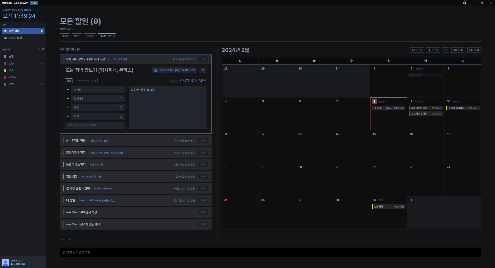

# Memorial

This repository includes the code for Memorial, desktop application for Windows, Mac and Linux.
Memorial is a simple and easy to use application that allows you to create tasks or schedules for your own.
You can add memo, title, deadline, category to create a task.
Memorial is a free and open source application. \
Unfortunately, download of Memorial is only available from github releases.
(download page will be available soon)

## Preview

## Features

- Create, edit, delete tasks
- Add memo, title, deadline, category to create a task
- Automatically synchronize through the cloud (self-made server)
- Compatible with Windows, Mac & iOS/Android Memorial application
- Free and open source (for now)
- Supports multiple view types (list, calendar, timeline, etc.)
- Automatically update on startup if there is a new version (testing)
- Automatically starts when the computer starts (can be turned off in settings)
- Supports only Korean, but most of the language can be supported to use.

## Installation

1. Download the latest version from the [releases page]
2. Install the downloaded file
3. Run the installed application
4. Create an account and log in
5. Start using Memorial

## Development

Memorial is developed with Electron, React, and Golang. \
If you want to contribute to the development of Memorial, please contact us.
